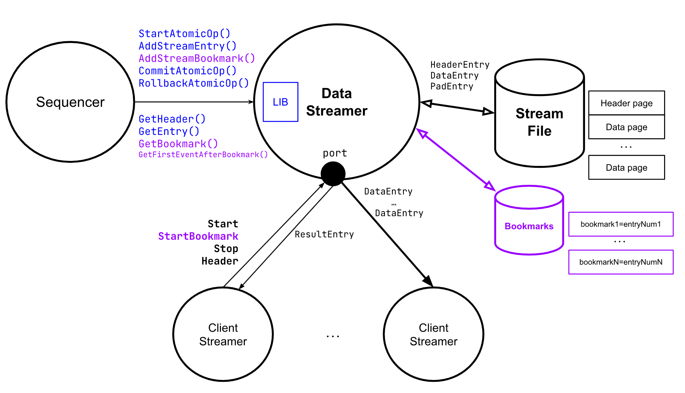
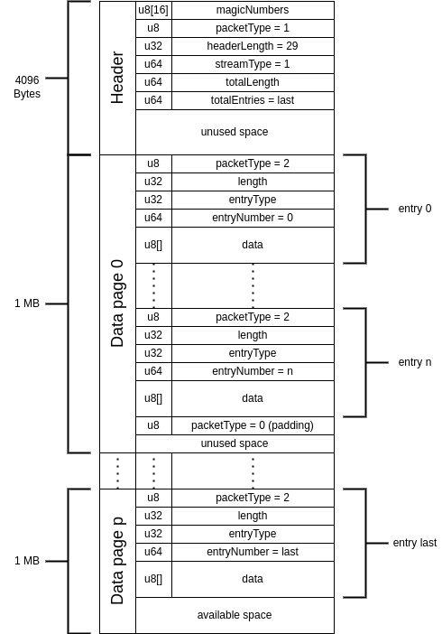
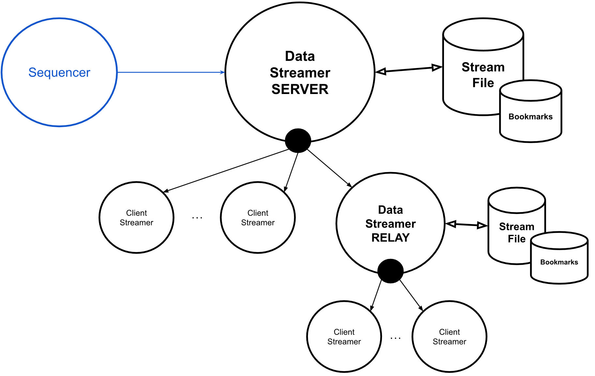

# zkEVM DataStreamer

Go implementation of a generic fast data streamer library. 

**Use case for the zkEVM Node**: Sequencer data stream service to stream L2 blocks and L2 txs.



## GENERAL DIAGRAM
Description of the diagram elements:

- **Sequencer**: uses the data streamer library through the API to send L2 blocks and L2 transactions to the stream. It's an use case of the datastreamer component.

- **Data Streamer**: creates the stream server, it manages the stream file and allows stream clients to connect using a TCP socket. For such stream clients, it offers a series of commands via the TCP port.

- **Stream File**: stores all the streaming data. It is a custom binary file organized into data pages with a preceding header page.

- **Bookmarks DB**: stores an index for the bookmarks that are available in the streaming file. It uses a LevelDB using the library [goleveldb](https://github.com/syndtr/goleveldb).

- **Streamer Client**: creates a stream client, it manages the data streamer connection and allows to execute the TCP commands available in the server.

## STREAM FILE
The binary file format is described below.

### Header page
- The first page is the header. 
- Header page size = 4096 bytes

#### Magic numbers
At the beginning of the file there are the following magic bytes (file signature): `polygonDATSTREAM`

#### HEADER ENTRY format (HeaderEntry)
>u8 packetType = 1 // 1:Header  
>u32 headerLength = 38 // Total length of header entry  
>u8 Version // Stream file version (starting from 1)  
>u64 SystemID // E.g.: ChainID  
>u64 streamType // 1:Sequencer  
>u64 TotalLength // Total bytes used in the file  
>u64 TotalEntries // Total number of data entries  

### Data page
- From the second page starts the data pages.  
- Page size = 1 MB

#### DATA ENTRY format (FileEntry)
>u8 packetType // 2:Data entry, 0:Padding  
>u32 Length // Total length of data entry (17 bytes + length(data))  
>u32 Type // 0xb0:Bookmark, 1:Event1, 2:Event2,...  
>u64 Number // Entry number (sequential starting with 0)  
>u8[] data  

NOTE: If an entry does not fit in the remaining page space, the entry will be stored in the next page.

### File diagram


## STREAM TCP COMMANDS
- All the commands available for the stream clients return first a response, a `Result` entry defined in a later section.
- Some commands like `Start` or `Header` may return more data.

Below is the detail of the available commands:

### Start 
Syncs from the entry number (`fromEntryNumber`) and starts receiving data streaming from that entry. 

Command format sent by the client:
>u64 command = 1  
>u64 streamType // e.g. 1:Sequencer  
>u64 fromEntryNumber  

If already started terminates the connection.

### StartBookmark
Syncs from the bookmark (`fromBookmark`) and starts receiving data streaming from the entry pointed by that bookmark.

Command format sent by the client:
>u64 command = 4  
>u64 streamType // e.g. 1:Sequencer  
>u32 bookmarkLength // Length of fromBookmark (Max bookmark length value is 16)  
>u8[] fromBookmark  

If already started or `bookmarkLength` exceeds the maximum length, terminates the connection.

### Stop
Stops the reception of the streaming transmission.

Command format sent by the client:
>u64 command = 2  
>u64 streamType // e.g. 1:Sequencer  

If not started terminates the connection.

### Header 
Gets the current stream file header (`HeaderEntry` format defined in the [STREAM FILE](#stream-file) section), so stream clients can know the total number of entries and the size of the stream file.

Command format sent by the client:
>u64 command = 3  
>u64 streamType // e.g. 1:Sequencer  

If streaming already started terminates the connection.

### Entry
Gets the data from the entry (`entryNumber`) in the format `FileEntry` defined in the [STREAM FILE](#stream-file) section).

Command format sent by the client:
>u64 command = 4  
>u64 streamType // e.g. 1:Sequencer  
>u64 entryNumber  

If streaming already started terminates the connection.

### Bookmark
Gets the data from the entry pointed by the bookmark (`bookmark`) in the format `FileEntry` defined in the [STREAM FILE](#stream-file) section).

Command format sent by the client:
>u64 command = 5  
>u64 streamType // e.g. 1:Sequencer  
>u32 bookmarkLength // Length of bookmark (Max bookmark length value is 16)  
>u8[] bookmark  

If streaming already started or `bookmarkLength` exceeds the maximum length, terminates the connection.

### RESULT FORMAT (ResultEntry)
Remember that all these TCP commands firstly return a response in the following detailed format:
>u8 packetType // 0xff:Result  
>u32 length // Total length of the entry  
>u32 errorNum // Error code (0:OK)  
>u8[] errorStr

## BOOKMARKS
Bookmarks make possible to the clients to sync the streaming from a business logic point.
- No need to store the latest `stream entry number` received.
- Using the API, bookmarks to business logic data are added in the send data to stream implementation.
- e.g. zkEVM Sequencer streaming: each L2 block number has its own bookmark. Clients can request to start the stream from a L2 block number.

## STREAM RELAY
Stream relay server included in the datastream library allows scaling the number of stream connected clients.



- **Data Streamer Relay** acts as a `stream client` towards the main data stream server, and also acts as a `stream server` towards the stream clients connected to it.


## DATA STREAMER INTERFACE (API)
### SERVER API
- Create and start a datastream server (`StreamServer`) using the `NewServer` function followed by the `Start` function.
- Send data to stream by starting an atomic operation through `StartAtomicOp`, adding entry events (`AddStreamEntry`) and bookmarks (`AddStreamBookmark`), and commit the operation `CommitAtomicOp`.

#### Send data API
- StartAtomicOp()  
- AddStreamBookmark(u8[] bookmark) -> returns u64 entryNumber  
- AddStreamEntry(u32 entryType, u8[] data) -> returns u64 entryNumber  
- CommitAtomicOp()  
- RollbackAtomicOp()  

#### Query data API
- GetHeader() -> returns struct HeaderEntry
- GetEntry(u64 entryNumber) -> returns struct FileEntry
- GetBookmark(u8[] bookmark) -> returns u64 entryNumber
- GetFirstEventAfterBookmark(u8[] bookmark) -> returns struct FileEntry

#### Update data API
- UpdateEntryData(u64 entryNumber, u32 entryType, u8[] newData)

### CLIENT API
- Create and start a datastream client (`StreamClient`) using the `NewClient` function followed by the `Start` function.
- Executes server commands by calling `ExecCommand`

#### Streaming API
- ExecCommand(datastreamer.CmdStart) -> starts receiving stream from the entry number specified by setting `.FromEntry` field
- ExecCommand(datastreamer.CmdStartBookmark) -> starts receiving stream from the entry pointed by bookmark specified by setting `.FromBookmark` field
- ExecCommand(datastreamer.CmdStop) -> stops receiving stream
- SetProcessEntryFunc(f `ProcessEntryFunc`) -> sets the callback function for each entry received. Overrides default function that just prints the entry fields.

#### Query data API
- ExecCommand(datastreamer.CmdHeader) -> gets data stream file header info and fills the `.Header` field
- ExecCommand(datastreamer.CmdEntry) -> gets entry data from entry number and fills the `.Entry` field
- ExecCommand(datastreamer.CmdBookmark) -> gets entry data pointed by bookmark and fills the `.Entry` field

## DATASTREAM CLI DEMO APP
Build the binary datastream demo app (`dsapp`):
```
make build-dsapp
```
Run the app without parameters to see the available commands:
```
./dsapp
```
```
NAME:
   dsapp - Run a datastream server/client/relay demo cli app

USAGE:
   dsapp [global options] command [command options] [arguments...]

COMMANDS:
   server   Run datastream server
   client   Run datastream client
   relay    Run datastream relay
   help, h  Shows a list of commands or help for one command

GLOBAL OPTIONS:
   --help, -h  show help
```
### SERVER
Use the help option to check available parameters for the server command:
```
./dsapp help server
```
```
NAME:
   dsapp server - Run datastream server

USAGE:
   dsapp server [command options] [arguments...]

OPTIONS:
   --port value   exposed port for clients to connect (default: 6900)
   --file value   datastream data file name (*.bin) (default: datastream.bin)
   --log value    log level (debug|info|warn|error) (default: info)
   --sleep value  initial sleep and sleep between atomic operations in ms (default: 0)
   --opers value  number of atomic operations (server will terminate after them) (default: 1000000)
   --help, -h     show help
```
Run a datastream server with default parameters (port: `6900`, file: `datastream.bin`, log: `info`):
```
./dsapp server
```
Or run a datastream server with custom parameters:
```
./dsapp server --port 6969 --file seqstream.bin --log warn
```
### CLIENT
Use the help option to check available parameters for the client command:
```
./dsapp help client
```
```
NAME:
   dsapp client - Run datastream client

USAGE:
   dsapp client [command options] [arguments...]

OPTIONS:
   --server value        datastream server address to connect (IP:port) (default: 127.0.0.1:6900)
   --from value          entry number to start the sync/streaming from (latest|0..N) (default: latest)
   --frombookmark value  bookmark to start the sync/streaming from (0..N) (has preference over --from parameter)
   --header              query file header information (default: false)
   --entry value         entry number to query data (0..N)
   --bookmark value      entry bookmark to query entry data pointed by it (0..N)
   --log value           log level (debug|info|warn|error) (default: info)
   --help, -h            show help
```
Run a datastream client with default parameters (server: `127.0.0.1:6900`, from: `latest`, log: `info`)
```
./dsapp client
```
Or run a datastream client with custom parameters:
```
./dsapp client --server 127.0.0.1:6969 --from 0 --log debug
```
Or just get the current stream header file information:
```
./dsapp client --server 127.0.0.1:6969 --header
```
### RELAY
Use the help option to check available parameters for the relay command:
```
./dsapp help relay
```
```
NAME:
   dsapp relay - Run datastream relay

USAGE:
   dsapp relay [command options] [arguments...]

OPTIONS:
   --server value  datastream server address to connect (IP:port) (default: 127.0.0.1:6900)
   --port value    exposed port for clients to connect (default: 7900)
   --file value    relay data file name (*.bin) (default: datarelay.bin)
   --log value     log level (debug|info|warn|error) (default: info)
   --help, -h      show help
```
Run a datastream relay with default parameters (server: `127.0.0.1:6900`, port: `7900`, file: `datarelay.bin`, log: `info`)
```
./dsapp relay
```

## USE CASE: zkEVM SEQUENCER ENTRIES
Sequencer data stream service to stream L2 blocks and L2 txs

List of events (entry types):

### Start L2 Block
- Entry type = 1
- Entry data:  
>u64 batchNum  
>u64 blockL2Num  
>u64 timestamp  
>u8[32] l1BlockHash  
>u8[32] globalExitRoot  
>u8[32] l1InfoRoot  
>u8[20] coinbase  
>u16 forkId  

### L2 TX
- Entry type = 2
- Entry data:  
>u8   gasPricePercentage  
>u8   isValid  // Intrinsic  
>u8[32] stateRoot  
>u32  encodedTXLength  
>u8[] encodedTX  

### End L2 Block
- Entry type = 3
- Entry data:
>u64  blockL2Num  
>u8[32] l2BlockHash  
>u8[32] stateRoot  

### Update GER
- Entry type = 4
- Entry data:  
>u64 batchNum  
>u64 timestamp  
>u8[32] globalExitRoot  
>u8[20] coinbase  
>u16 forkId  
>u8[32]  stateRoot  
