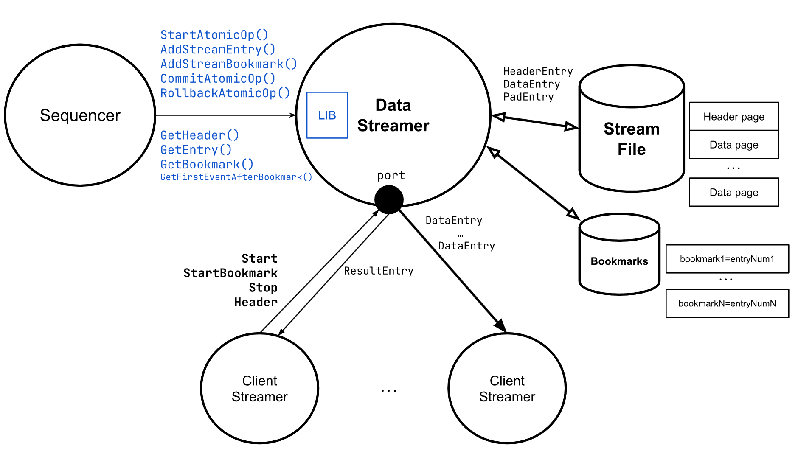

# zkEVM DataStreamer

## Binary file format

### Header page

The first page is the header.  
Header page size = 4096 bytes

#### Header entry format

>u8 packetType=1  
>u32 headerLength=29  
>u64 streamType // 1:Sequencer  
>u64 totalLength // Total bytes used in the file  
>u64 totalEntries // Total number of data entries  

### Data page

From the second page starts the data pages.  
Page size = 1 MB

#### Data entry format
>u8 packetType // 2:Data entry, 0:Padding, (1:Header)  
>u32 length // Total length of the entry (17 bytes + length(data))  
>u32 entryType // 1:L2 block, 2:L2 tx  
>u64 entryNumber // Entry number (sequential starting with 0)  
>u8[] data  

If an entry do not fits in the remaining page space we store this entry in the next page.

### Diagram

## TCP/IP Commands

All the commands available for stream clients returns a result.  
Some commands like start may return more data.

### Start 

>u64 command = 1;  
>u64 streamType // 1:Sequencer  
>u64 fromEntryNumber;  

After the command, the system start stream data from that entry number.

If already started terminate connection.

### Stop

>u64 command = 2;  
>u64 streamType // 1:Sequencer  

Stop streaming data.

If not started terminate connection.

The result is sended just after it's stopped.

### Header 

>u64 command = 3;  
>u64 streamType // 1:Sequencer  

Returns the current status of the header.

If started, terminate the connection.

#### Result format

>u8 packetType // 0xFF:Result  
>u32 length // Total length of the entry  
>u32 errorNum // Error code (0:OK)  
>u8[] errorStr

## Sequencer entries

### Start L2 Block

Entry type = 1

Entry data:  
>u64 batchNum  
>u64 blockL2Num  
>u64 Timestamp  
>u8[32] GlobalExitRoot  
>u8[20] CoinBase  

### L2 TX

Entry type = 2

Entry data:  
>u64  batchNum  
>u8   gasPricePercentage  
>u8   isValid  // Intrinsic   
>u32  encodedTXLength  
>u8[] encodedTX  

## API Interface

StartAtomicOp()  
AddStreamEntry(u32 entryType, u8[] data) -> return u64 entryNumber  
CommitAtomicOp()  
RollbackAtomicOp()  
